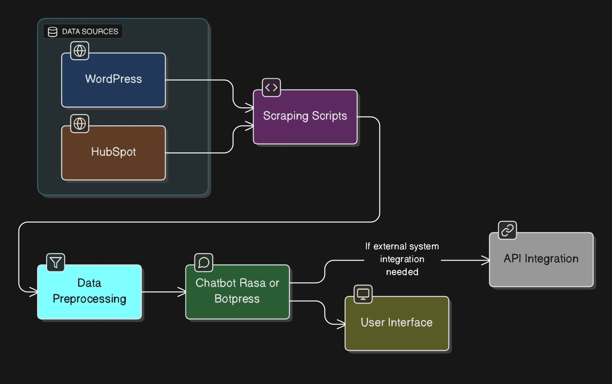

CKB-AI-CHATBOT
==============

_Empowering Conversations, Unlocking Knowledge Instantly_

  

_Built with the tools and technologies:_

        
      

***

## High-Level Design (HLD)

Below is the **High-Level Design (HLD)** of the system, illustrating the architecture and deployment model of the system in Production.

  

* * *

Table of Contents
-----------------

*   [Overview](#overview)
*   [Getting Started](#getting-started)
    *   [Prerequisites](#prerequisites)
    *   [Installation](#installation)
    *   [Usage](#usage)
    *   [Testing](#testing)

* * *

🤖 Overview
--------

ckb-ai-chatbot is a custom knowledge base AI solution that allows businesses to create intelligent chatbots trained on their specific content and documentation. The system enables seamless integration of AI-powered customer support directly into any website.

**Why ckb-ai-chatbot?**

This project empowers developers to create conversational AI systems that seamlessly ingest and retrieve knowledge from diverse sources. The core features include:

*   🛠️ **Deployment Automation:** Streamlined CI/CD workflows for efficient release cycles.
*   🚀 **Containerized Environment:** Self-contained Docker setup for consistent builds and runtime.
*   🔍 **Semantic Content Search:** Intelligent ingestion and retrieval from files, web links, and WordPress content.
*   💬 **Real-Time Chat Interface:** Interactive UI for engaging AI conversations.
*   🧑‍💻 **Admin Tools:** Easy management of data sources and knowledge base maintenance.
*   🔧 **Flexible Configuration:** Environment variables and version tracking for reliable deployment.

* * *

Getting Started
---------------

### Prerequisites

This project requires the following dependencies:

*   **Programming Language:** JavaScript
*   **Package Manager:** Npm
*   **Container Runtime:** Docker

### Installation

Build ckb-ai-chatbot from the source and install dependencies:

1.  **Clone the repository:**
    
        ❯ git clone https://github.com/abhijeetsatpute/ckb-ai-chatbot
        
    
2.  **Navigate to the project directory:**
    
        ❯ cd ckb-ai-chatbot
        
    
3.  **Install the dependencies:**
    

**Using [docker](https://www.docker.com/):**

    ❯ docker build -t abhijeetsatpute/ckb-ai-chatbot .
    

**Using [npm](https://www.npmjs.com/):**

    ❯ npm install
    

### Usage

Run the project with:

**Using [docker](https://www.docker.com/):**

    docker run -it {image_name}
    

**Using [npm](https://www.npmjs.com/):**

    npm start
    
* * *

[⬆ Return](#top)

* * *